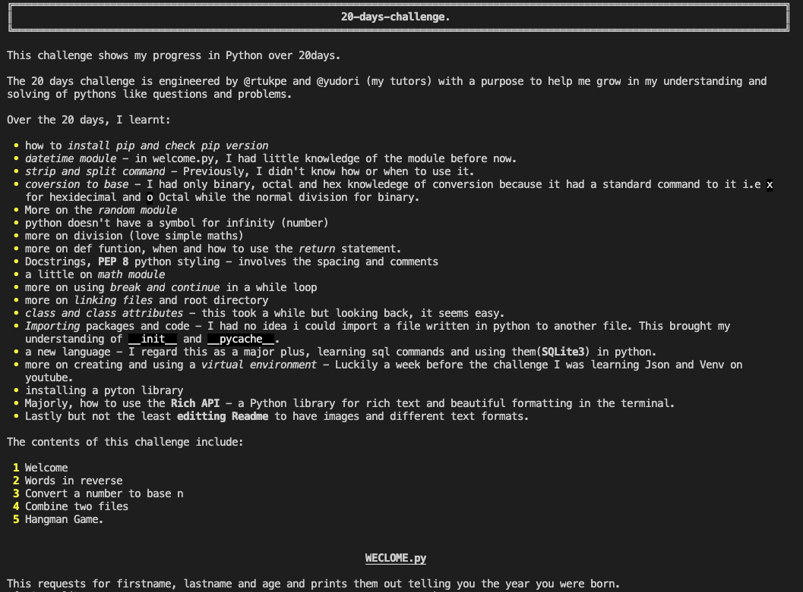
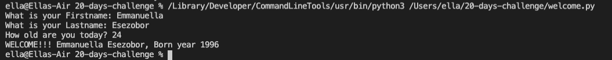
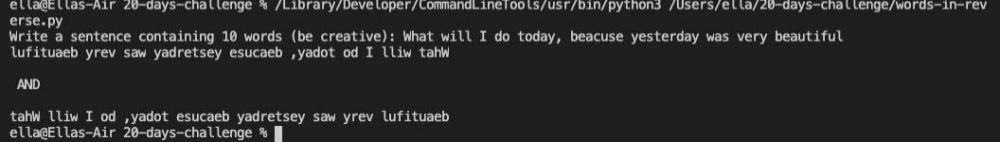
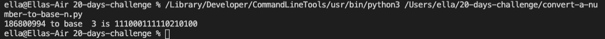
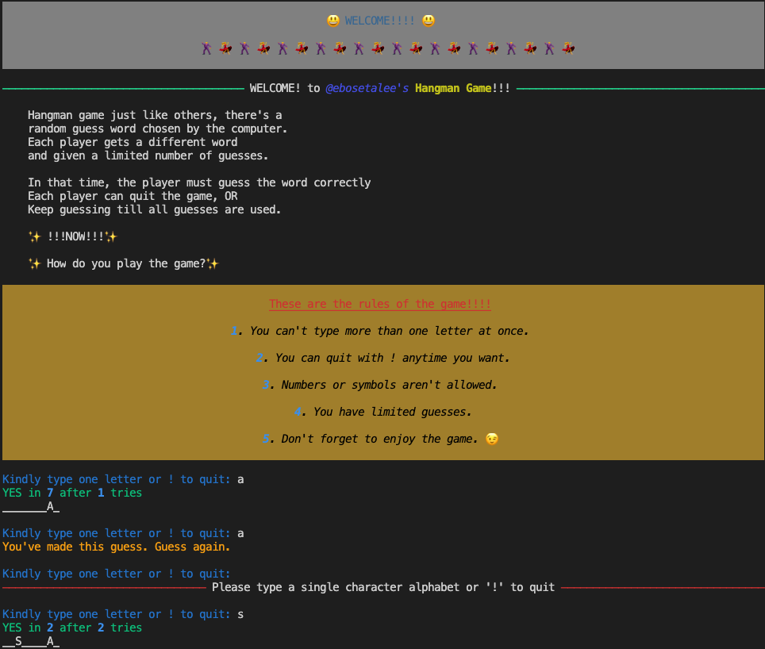
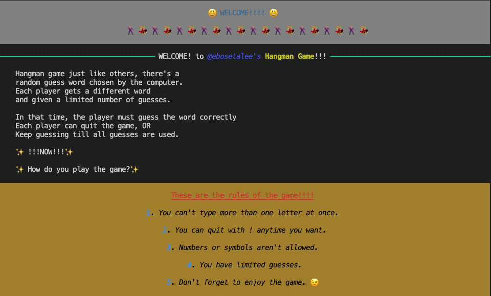
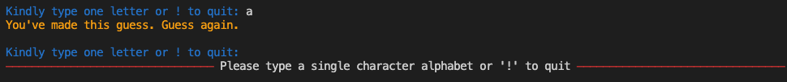
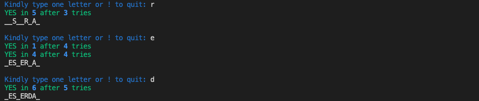

# 20 Days Python Coding Challenge.

This challenge shows my progress in Python over 20days.


The 20 days challenge is engineered by [@jirevwe](https://github.com/jirevwe) and [@yudori](https://github.com/yudori) (my tutors) with a purpose to help me grow in my understanding and solving of pythons like questions and problems. 

Over the 20 days, I learnt: 
- how to _install pip and check pip version_
- _datetime module_ - in welcome.py, I had little knowledge of the module before now.
- _strip and split command_ - Previously, I didn't know how or when to use it.
- _coversion to base_ - I had only binary, octal and hex knowledege of conversion because it had a standard command to it i.e `x` for hexidecimal and `o` Octal while the normal division for binary.
- More on the _random module_ 
- python doesn't have a symbol for infinity (number)
- more on division (love simple maths)
- more on def funtion, when and how to use the _return_ statement.
- Docstrings, __PEP 8__ python styling - involves the spacing and comments
- a little on _math module_
- more on using _break and continue_ in a while loop
- more on _linking files_ and root directory
- _class and class attributes_ - this took a while but looking back, it seems easy.
- _Importing_ packages and code - I had no idea i could import a file written in python to another file. This brought my understanding of `__init__` and `__pycache__`.
- a new language - I regard this as a major plus, learning sql commands and using them(__SQLite3__) in python.
- more on creating and using a _Virtual Environment_ - Luckily a week before the challenge I was learning __Json__ and __Venv__ on youtube.
- installing a pyton library
- Majorly, how to use the __Rich API__ - a Python library for rich text and beautiful formatting in the terminal.
- Lastly but not the least __editing Readme__ to have images and different text formats.

The contents of this challenge include:
1. Welcome
2. Words in reverse
3. Convert a number to base n
4. Combine two files
5. Hangman Game.

## WECLOME.py
This requests for firstname, lastname and age and prints them out telling you the year you were born.


## WORDS IN REVERSE.py
This requests a sentence from the user and prints it in two different reverse forms.


## CONVERT A NUMBER TO BASE N.py
A number between 0 and 1000000000 is randomly selected by the computer and converted to a random base between 2 and 16 except 10.


## COMBINE TWO FILES.py
This collects the contents of two files, combines them and writes the comibined data into another file.

## HANGMAN.py
This is a game that the computer chooses a random word from a text file containing 852 words. The player tries to guess the exact word, following the game's introduction.
 

The game uses the rich library to show color and style to the introduction as well as what the game prints out. It runs with the rich console width of 120.
```console = Console(width=120)```

At the start the player gets an introduction and the rules of the game to ensure the player is familiar with the output.


Then the game tells the player to guess a letter.
If the player doesn't follow the instruction, the following output prints depending on which rule was ignored.


Whereas, if a letter is guessed correctly, the game prints the following:


See [hangman](https://repl.it/@EmmanuellaEsezo/hangman) to play or clone the repository.
